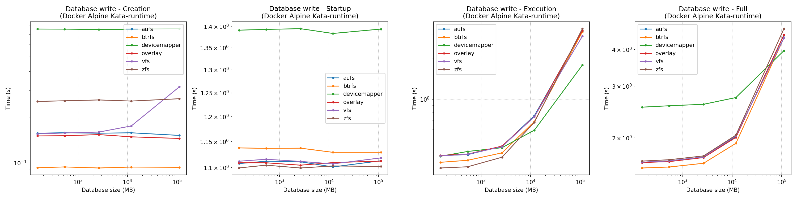
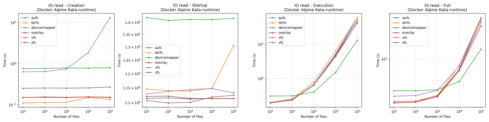
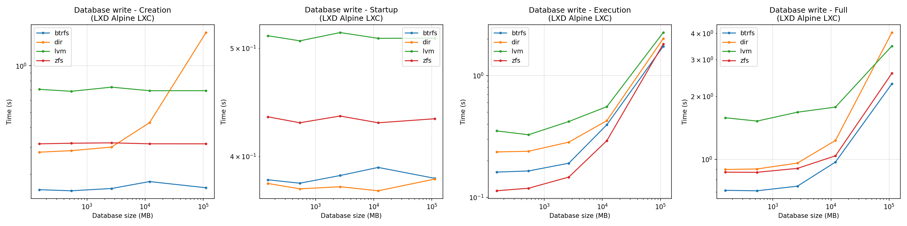
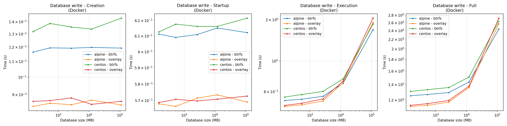

# Some more graphs
In this folder are presented some more graphs in case the reader wished to see more of the results obtained to the 
different tests.

In this document the following graphs are organized by category:
 - [Storage driver comparison](#storage-driver-comparison)
   - [Docker with runc](#docker-with-runc)
   - [Docker with Kata-runtime](#docker-with-kata-runtime)
   - [LXD](#lxd)
 - [Base image comparison](#base-image-comparison)
 - [Container runtime comparison](#container-runtime-comparison)
 - [Container manager comparison](#container-manager-comparison)

## Storage driver comparison
### Docker with runc

### Docker with Kata-runtime

### LXD

## Container runtime comparison

## Base image comparison

## Container manager comparison

